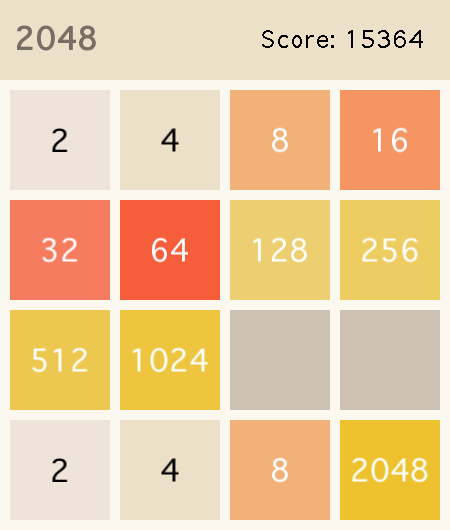

# sfml-2048

> A classic 2048 clone built with modern C++ — designed from the ground up for testability, cross-platform CI, and clean architecture.



[](https://github.com/EnesGoker/sfml-2048/actions/workflows/ci.yml)
[](https://github.com/EnesGoker/sfml-2048/actions/workflows/release.yml)
[](LICENSE)
[](https://en.cppreference.com/w/cpp/20)
[](https://www.sfml-dev.org/)

---

## What is this?

This is not just a 2048 clone. It's a **portfolio-grade C++ project** that demonstrates:

- A game engine core that is **completely decoupled from SFML** and fully unit-testable
- A **multi-platform CI pipeline** covering Ubuntu, macOS, and Windows
- **Deterministic gameplay** via seed support — every run is reproducible
- Automated versioning and release artifact distribution

If you're here to play the game, great. If you're here to understand how it's built, read on.

---

## Getting Started

### Prerequisites

- CMake 3.24+
- vcpkg (with `VCPKG_ROOT` set)
- A C++20-capable compiler (GCC 11+, Clang 13+, MSVC 2022+)

### Build & Run

**macOS / Linux**
```bash
cmake --preset vcpkg-debug
cmake --build --preset build-vcpkg-debug
./build/vcpkg-debug/sfml_2048
```

**Windows**
```bat
cmake --preset vcpkg-debug
cmake --build --preset build-vcpkg-debug
build\vcpkg-debug\sfml_2048.exe
```

### CLI Options

| Flag | Description |
|---|---|
| `--seed <uint32>` | Run with a fixed seed for deterministic gameplay |
| `--fps <uint>` | Set frame rate cap |
| `--vsync` | Enable vertical sync |
| `--no-vsync` | Disable vertical sync |
| `--help` | Show usage |

---

## How to Play

| Input | Action |
|---|---|
| Arrow keys | Move tiles |
| `Esc` (in-game) | Return to splash screen |
| `N` / `Enter` (game over) | Start a new game |
| `Q` / `Esc` (game over) | Quit |

---

## Architecture

The project is split into two clear layers:

```text
src/
├── core/     <- Pure game logic. No SFML. Fully testable.
└── app/      <- SFML rendering, input handling, window management
```

The `core` layer knows nothing about SFML — it operates on plain data structures and can be exercised by unit tests without a display. The `app` layer owns all rendering and delegates game state changes back to `core`.

This separation means:
- You can swap the renderer without touching game logic
- Unit tests are fast and dependency-free
- Business rules are easy to reason about in isolation

For full details, see [docs/architecture.md](docs/architecture.md).

---

## Testing

Tests are written with **Catch2** and run via **CTest**.

```bash
ctest --test-dir build/vcpkg-debug --output-on-failure
```

The CI pipeline runs tests under multiple sanitizers (AddressSanitizer, UBSanitizer) and generates coverage reports on every push/PR. See [docs/testing.md](docs/testing.md) for the full strategy.

---

## CI / CD

Every pull request goes through:

1. `clang-format` check
2. Static analysis
3. Cross-platform build (Ubuntu · macOS · Windows)
4. Unit tests + sanitizers
5. Coverage report

Pushing a `vX.Y.Z` tag triggers an automated release with downloadable binaries for all three platforms.

---

## Tech Stack

| | |
|---|---|
| Language | C++20 |
| Graphics / Input | SFML 2.6.2 |
| Build System | CMake + CMake Presets |
| Dependency Management | vcpkg (manifest mode) |
| Testing | Catch2 + CTest |
| CI/CD | GitHub Actions |

---

## Documentation

- [Architecture](docs/architecture.md)
- [Testing Strategy](docs/testing.md)
- [Maintenance Playbook](docs/maintenance.md)
- [Changelog](CHANGELOG.md)
- [Contributing](CONTRIBUTING.md)
- [Security Policy](SECURITY.md)
- [Third-Party Notices](THIRD_PARTY_NOTICES.md)

---

## License

MIT — see [LICENSE](LICENSE) for details.
