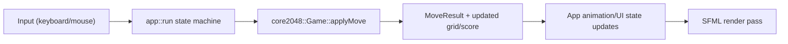

# Architecture

## Goal

This project separates gameplay rules from rendering so the core logic can be tested, reused, and evolved independently of SFML.

## Module Layout

- `src/core`: game rules and state transitions, no SFML dependency.
- `src/app`: SFML window, input handling, rendering, and UI state machine.

## Core Domain Model

- `core2048::Game::Grid`: fixed `4x4` board.
- `core2048::Direction`: `Up | Down | Left | Right`.
- `core2048::MoveResult`:
  - `moved`: whether board state changed.
  - `scoreDelta`: score gained by that move.
  - `spawnedTile`: spawned tile position/value when applicable.

Public core API (`src/core/Game.hpp`):

- `reset()`
- `reset(seed)`
- `loadState(grid, score)` for test setup
- `applyMove(direction, spawnOnMove=true)`
- `getGrid()`
- `getScore()`
- `isGameOver()`

## App Layer Responsibilities

- Resolve assets and load fonts relative to executable/cwd candidates.
- Own high-level UI states: `Splash -> Playing -> GameOver`.
- Translate keyboard/mouse input into core actions.
- Render score, board, tile values, overlay, and button states.
- Keep transient animation state (`spawnAnimations`) out of core.

## Runtime Data Flow

## Design Constraints

- Core must stay SFML-independent.
- Randomness is deterministic when `seed` is provided.
- UI can change without modifying merge/move/game-over rules.
- Tests validate core behavior without creating a window.
